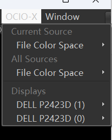

# rv-auto-ocio

open rv auto ocio setting from file format.

## 插件信息:

Author: 白衬衣

Date : 2024/06

## 插件说明:

> 插件从官方源码修改而来，是为了实现根据图片格式自动切换色彩空间.

1. 该插件在 Rv2023 版本下开发，其他版本未经测试，谨慎使用.
2. 使用该插件时确保 `OCIO` 环境变量设置并且指向正确的 OCIO 配置文件.
3. 使用前请先关闭官方自带的 OCIO 插件.

## 如何修改:



打开 `auto_ocio_setup.py` 文件：

1. 找到 `FILE_OCIO_FORMAT_SUPPORT` 全局变量，这里定义了 File Color Space 和文件格式对应的色彩空间.
2. 找到 `DISPLAY_OCIO_FORMAT_SUPPORT` 全局变量，这里定义了显示器 Displays 文件和色彩空间对应的字典.

## 小技巧:

如果你发现在新增格式对应色彩空间的时候,色彩空间的名字怕打错或者写起来太麻烦,
请打开`file.ocio` 和 `display.ocio` 文件，里面分别列出了 `FILE_OCIO_FORMAT_SUPPORT` 和 `DISPLAY_OCIO_FORMAT_SUPPORT`
的色彩空间的名字，可以直接复制粘贴.

## 修改完整之后如何发布:

移步 `publish.bat` 文件，这是我在编写脚本的时候用的自动化命令行.

### 如何打包

命令行使用 `zip.exe` 打包

```shell
zip auto_ocio_setup-1.0.rvpkg auto_ocio_setup.py PACKAGE
```

## 如何安装

### 安装在软件安装目录.

1. 将打包后的 `.rvpkg` 格式的文件移动到 安装目录下的 `/plugins/Packages` 文件夹.
2. 将 `auto_ocio_setup.py` 文件复制到 `/plugins/Python` 文件夹.

### 通过环境变量

```shell
RV_SUPPORT_PATH
```

1. 将打包后的 `.rvpkg` 格式的文件移动到 `/Packages` 文件夹.
2. 将 `auto_ocio_setup.py` 文件复制到 `/Python` 文件夹.
